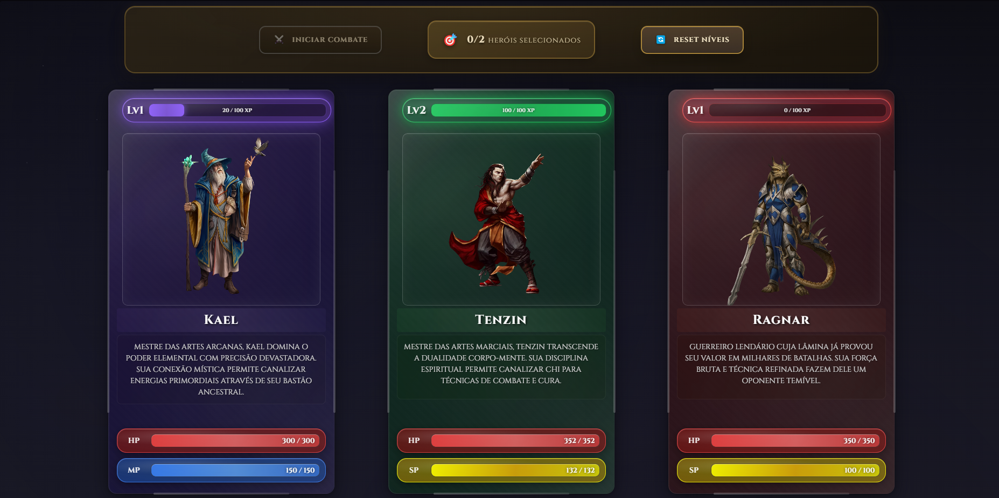

# ⚔️ Ethereal - Arena dos Heróis

[](https://developer.mozilla.org/pt-BR/docs/Web/JavaScript)
[](https://developer.mozilla.org/pt-BR/docs/Web/HTML)
[](https://developer.mozilla.org/pt-BR/docs/Web/CSS)
[](https://desafio-classes.vercel.app)
[](LICENSE)

## 🌐 Demo Online

**🎮 [Jogar Agora](https://desafio-classes.vercel.app)**



_Interface do jogo mostrando os cards dos heróis Kael, Tenzin e Ragnar com suas respectivas estatísticas e habilidades_

### 🎮 Características Visuais

- **Cards Interativos**: Design moderno com efeitos de vidro e gradientes
- **Temas por Classe**: Cada herói tem sua cor temática (Roxo para Mago, Verde para Monge, Vermelho para Guerreiro)
- **Interface Responsiva**: Adaptável a diferentes tamanhos de tela
- **Animações Suaves**: Efeitos visuais e transições fluidas

## 📋 Descrição

**Ethereal** é um sistema de combate por turnos desenvolvido em JavaScript que implementa um jogo de heróis com diferentes classes, habilidades e sistema de progressão. O projeto demonstra o uso avançado de classes, objetos, herança e programação orientada a objetos em JavaScript, oferecendo uma experiência de RPG medieval com interface moderna e responsiva.

Agora conta também com um fluxo simples de autenticação pelo Firebase. É possível entrar com Google ou criar uma conta usando e-mail e senha. Após fazer login, o jogador escolhe um dos heróis disponíveis e segue para a arena.

## 🎮 Funcionalidades

- ✅ **Sistema de Classes**: 4 tipos de heróis (Mago, Guerreiro, Monge, Ninja)
- ✅ **Sistema de Combate**: Batalhas por turnos com lógica de habilidades
- ✅ **Interface Visual**: Cards interativos com animações e efeitos visuais
- ✅ **Sistema de XP**: Progressão de nível com ganho de experiência
- ✅ **Habilidades Únicas**: Cada herói possui 4 habilidades diferentes
- ✅ **Arena de Batalha**: Sistema de duelo entre dois heróis
- ✅ **Persistência**: Dados salvos no localStorage
- ✅ **Design Responsivo**: Interface adaptável a diferentes telas
- ✅ **Autenticação**: Login com Google ou cadastro por e-mail usando Firebase
- ✅ **Escolha de Herói**: Jogador seleciona seu herói após o login

## 🏆 Classes de Herói

| Classe        | Ataque Básico  | Energia | Especialidade               |
| ------------- | -------------- | ------- | --------------------------- |
| **Mago**      | magia          | MP      | Poder mágico devastador     |
| **Guerreiro** | espada         | SP      | Combate corpo a corpo       |
| **Monge**     | artes marciais | SP      | Técnicas de cura e defesa   |
| **Ninja**     | shuriken       | SP      | Ataques furtivos e precisos |

## 🎯 Sistema de Combate

### Mecânicas Principais

- **Turnos Alternados**: Cada herói ataca em sequência
- **Sistema de Energia**: MP para Magos, SP para outras classes
- **Habilidades Especiais**: 4 habilidades por herói (ataque, poder, defesa, ultimate)
- **Recuperação de Energia**: Ataques básicos restauram energia
- **Sistema de Guarda**: Habilidades defensivas reduzem dano

### Tipos de Habilidade

- **Ataque**: Dano básico sem custo
- **Poder**: Dano aumentado com custo de energia
- **Defesa**: Cura e proteção temporária
- **Ultimate**: Dano massivo com alto custo

## 🛠️ Tecnologias Utilizadas

- **JavaScript ES6+**: Lógica principal do jogo
- **HTML5**: Estrutura da interface
- **CSS3**: Estilização avançada com animações
- **LocalStorage**: Persistência de dados
- **Canvas/Web APIs**: Efeitos visuais

## 🚀 Deploy

- **Plataforma**: [Vercel](https://vercel.com)
- **URL**: https://desafio-classes.vercel.app
- **Status**: ✅ Online e Funcionando

## 🚀 Como Executar

```bash
# Clone o repositório
git clone https://github.com/leandromlmoreira/desafioClasses

# Entre no diretório
cd desafioClasses

# Abra o arquivo index.html no navegador
# Ou use um servidor local:
python -m http.server 8000
# Acesse: http://localhost:8000
```

### Configuração do Firebase

1. Copie `src/js/firebaseConfig.sample.js` para `src/js/firebaseConfig.js`
2. Preencha o arquivo com as credenciais do seu projeto Firebase
3. Mantenha `firebaseConfig.js` fora do controle de versão

## 🎨 Interface

### Cards de Herói

- **Design Moderno**: Cards com efeitos de vidro e gradientes
- **Informações Detalhadas**: HP, MP/SP, nível, XP
- **Habilidades Visuais**: 4 abas com descrições e custos
- **Animações**: Efeitos de hover, seleção e flip

### Arena de Batalha

- **Visualização em Tempo Real**: Animações de ataque e defesa
- **Log de Combate**: Histórico detalhado dos turnos
- **Efeitos Visuais**: Glows, partículas e transições
- **Resultados**: Vencedor, perdedor e ganho de XP

## 📊 Sistema de Progressão

### Experiência e Níveis

- **Ganho de XP**: 50 XP para vencedor, 10 XP para perdedor
- **Níveis**: 10 níveis com requisitos crescentes de XP
- **Melhorias**: HP, MP/SP e stats de combate aumentam por nível
- **Persistência**: Progresso salvo automaticamente

### Stats de Combate

- **Ataque**: Dano físico
- **Poder Mágico**: Dano de habilidades especiais
- **Defesa**: Redução de dano recebido

## 📁 Estrutura do Projeto

Para detalhes completos sobre a organização de pastas, consulte a [documentação de estrutura](docs/STRUCTURE.md).

```
desafioClasses/
├── index.html              # Interface principal
├── src/                    # Código fonte
│   ├── css/               # Estilos
│   │   ├── styles.css     # Estilos gerais
│   │   └── cards.css      # Estilos dos cards
│   ├── js/                # JavaScript
│   │   └── app.js         # Lógica do jogo
│   ├── assets/            # Recursos
│   │   └── images/        # Imagens
│   │       ├── kael.png
│   │       ├── ragnar.png
│   │       ├── tenzin.png
│   │       ├── akari.png
│   │       ├── preview.png
│   │       └── favicon.png
│   └── data/              # Dados
│       └── heroes.json    # Dados dos heróis
├── scripts/               # Scripts utilitários
│   └── version.js         # Script de versionamento
├── docs/                  # Documentação
│   ├── VERSIONING.md      # Documentação do versionamento
│   └── STRUCTURE.md       # Documentação da estrutura
├── VERSION                # Controle de versão
├── CHANGELOG.md           # Histórico de mudanças
├── package.json           # Configuração do projeto
├── vercel.json            # Configuração do deploy
├── .prettierrc            # Configuração do Prettier
├── .prettierignore        # Arquivos ignorados pelo Prettier
├── .editorconfig          # Configuração do EditorConfig
├── .cursorrules           # Regras para Cursor AI
├── .vscode/               # Configurações do VS Code
│   ├── settings.json      # Configurações do editor
│   ├── extensions.json    # Extensões recomendadas
│   ├── launch.json        # Configuração de debug
│   └── tasks.json         # Tarefas automatizadas
├── .husky/                # Git hooks
│   └── pre-commit         # Hook de pre-commit
├── LICENSE                # Licença
└── README.md              # Documentação principal
```

## 🔄 Sistema de Versionamento

O projeto utiliza versionamento semântico (SemVer) com os seguintes arquivos:

- **VERSION**: Contém a versão atual do projeto
- **CHANGELOG.md**: Documenta todas as mudanças por versão
- **scripts/version.js**: Script para automatizar o versionamento

Para mais detalhes, consulte a [documentação de versionamento](docs/VERSIONING.md).

## 🎨 Formatação de Código

O projeto utiliza **Prettier** para manter a consistência na formatação do código:

```bash
# Formatar todos os arquivos
npm run format

# Verificar se os arquivos estão formatados
npm run format:check

# Formatar em modo watch (automático)
npm run format:watch

# Executar pre-commit hooks
npm run pre-commit
```

### Configuração do Prettier

- **Arquivo**: `.prettierrc`
- **Ignorados**: `.prettierignore`
- **Extensões**: JS, JSON, CSS, HTML, MD

### Auto-formatação

- **Format on Save**: Ativado no VS Code
- **Pre-commit hooks**: Formatação automática antes de commits
- **EditorConfig**: Configuração consistente entre editores
- **Cursor Rules**: Regras para Cursor AI

### Comandos de Versionamento

```bash
# Ver versão atual
node tools/scripts/scripts/version.js current

# Incrementar versão (patch, minor, major)
node tools/scripts/scripts/version.js bump patch
node tools/scripts/scripts/version.js bump minor
node tools/scripts/scripts/version.js bump major

# Definir versão específica
node tools/scripts/scripts/version.js set 1.2.3

# Usando npm scripts
npm run version:current
npm run version:bump:patch
npm run version:bump:minor
npm run version:bump:major
```

## 🎮 Como Jogar

1. **Faça Login**: Acesse `login.html` e entre com Google ou crie uma conta com e-mail
2. **Escolha um Herói**: Após autenticar, selecione seu herói preferido
3. **Seleção de Heróis para Combate**: Clique com botão direito para escolher 2 heróis
4. **Iniciar Combate**: Clique em "INICIAR COMBATE" quando 2 heróis estiverem selecionados
5. **Acompanhar Batalha**: Assista às animações e log de combate
6. **Ver Resultados**: Confira o vencedor e ganho de XP
7. **Repetir**: Use "NOVAMENTE" para repetir o combate

## 🔧 Recursos Técnicos

### Classes JavaScript

- **Hero**: Classe principal com propriedades e métodos
- **Sistema de Cache**: Persistência via localStorage
- **Lógica de Combate**: Algoritmos de escolha de habilidades
- **Animações**: Sistema de efeitos visuais

### CSS Avançado

- **Grid Layout**: Sistema responsivo de cards
- **Flexbox**: Layout flexível da arena
- **Animações CSS**: Keyframes e transições
- **Variáveis CSS**: Sistema de temas por classe

## 📈 Melhorias Futuras

- [ ] Sistema de equipamentos
- [ ] Mais tipos de heróis
- [ ] Modo história
- [ ] Multiplayer local
- [ ] Sistema de ranking
- [ ] Mais habilidades por herói

## 🤝 Contribuição

Contribuições são sempre bem-vindas! Sinta-se à vontade para:

- Reportar bugs
- Sugerir melhorias
- Adicionar novas funcionalidades
- Melhorar a documentação

---

**Tags**: `javascript` `html` `css` `game` `rpg` `combat` `classes` `objetos` `animations` `localStorage`
