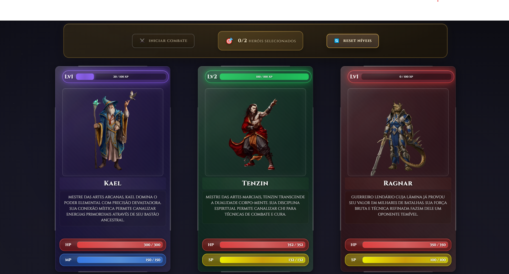

# ⚔️ Ethereal - Arena dos Heróis

[](https://developer.mozilla.org/pt-BR/docs/Web/JavaScript)
[](https://developer.mozilla.org/pt-BR/docs/Web/HTML)
[](https://developer.mozilla.org/pt-BR/docs/Web/CSS)
[](https://desafio-classes.vercel.app)
[](LICENSE)

## 🌐 Demo Online

**🎮 [Jogar Agora](https://desafio-classes.vercel.app)**



*Interface do jogo mostrando os cards dos heróis Kael, Tenzin e Ragnar com suas respectivas estatísticas e habilidades*

### 🎮 Características Visuais

- **Cards Interativos**: Design moderno com efeitos de vidro e gradientes
- **Temas por Classe**: Cada herói tem sua cor temática (Roxo para Mago, Verde para Monge, Vermelho para Guerreiro)
- **Interface Responsiva**: Adaptável a diferentes tamanhos de tela
- **Animações Suaves**: Efeitos visuais e transições fluidas

## 📋 Descrição

**Ethereal** é um sistema de combate por turnos desenvolvido em JavaScript que implementa um jogo de heróis com diferentes classes, habilidades e sistema de progressão. O projeto demonstra o uso avançado de classes, objetos, herança e programação orientada a objetos em JavaScript, oferecendo uma experiência de RPG medieval com interface moderna e responsiva.

## 🎮 Funcionalidades

- ✅ **Sistema de Classes**: 4 tipos de heróis (Mago, Guerreiro, Monge, Ninja)
- ✅ **Sistema de Combate**: Batalhas por turnos com lógica de habilidades
- ✅ **Interface Visual**: Cards interativos com animações e efeitos visuais
- ✅ **Sistema de XP**: Progressão de nível com ganho de experiência
- ✅ **Habilidades Únicas**: Cada herói possui 4 habilidades diferentes
- ✅ **Arena de Batalha**: Sistema de duelo entre dois heróis
- ✅ **Persistência**: Dados salvos no localStorage
- ✅ **Design Responsivo**: Interface adaptável a diferentes telas

## 🏆 Classes de Herói

| Classe | Ataque Básico | Energia | Especialidade |
|--------|---------------|---------|---------------|
| **Mago** | magia | MP | Poder mágico devastador |
| **Guerreiro** | espada | SP | Combate corpo a corpo |
| **Monge** | artes marciais | SP | Técnicas de cura e defesa |
| **Ninja** | shuriken | SP | Ataques furtivos e precisos |

## 🎯 Sistema de Combate

### Mecânicas Principais
- **Turnos Alternados**: Cada herói ataca em sequência
- **Sistema de Energia**: MP para Magos, SP para outras classes
- **Habilidades Especiais**: 4 habilidades por herói (ataque, poder, defesa, ultimate)
- **Recuperação de Energia**: Ataques básicos restauram energia
- **Sistema de Guarda**: Habilidades defensivas reduzem dano

### Tipos de Habilidade
- **Ataque**: Dano básico sem custo
- **Poder**: Dano aumentado com custo de energia
- **Defesa**: Cura e proteção temporária
- **Ultimate**: Dano massivo com alto custo

## 🛠️ Tecnologias Utilizadas

- **JavaScript ES6+**: Lógica principal do jogo
- **HTML5**: Estrutura da interface
- **CSS3**: Estilização avançada com animações
- **LocalStorage**: Persistência de dados
- **Canvas/Web APIs**: Efeitos visuais

## 🚀 Deploy

- **Plataforma**: [Vercel](https://vercel.com)
- **URL**: https://desafio-classes.vercel.app
- **Status**: ✅ Online e Funcionando

## 🚀 Como Executar

```bash
# Clone o repositório
git clone https://github.com/leandromlmoreira/desafioClasses

# Entre no diretório
cd desafioClasses

# Abra o arquivo index.html no navegador
# Ou use um servidor local:
python -m http.server 8000
# Acesse: http://localhost:8000
```

## 🎨 Interface

### Cards de Herói
- **Design Moderno**: Cards com efeitos de vidro e gradientes
- **Informações Detalhadas**: HP, MP/SP, nível, XP
- **Habilidades Visuais**: 4 abas com descrições e custos
- **Animações**: Efeitos de hover, seleção e flip

### Arena de Batalha
- **Visualização em Tempo Real**: Animações de ataque e defesa
- **Log de Combate**: Histórico detalhado dos turnos
- **Efeitos Visuais**: Glows, partículas e transições
- **Resultados**: Vencedor, perdedor e ganho de XP

## 📊 Sistema de Progressão

### Experiência e Níveis
- **Ganho de XP**: 50 XP para vencedor, 10 XP para perdedor
- **Níveis**: 10 níveis com requisitos crescentes de XP
- **Melhorias**: HP, MP/SP e stats de combate aumentam por nível
- **Persistência**: Progresso salvo automaticamente

### Stats de Combate
- **Ataque**: Dano físico
- **Poder Mágico**: Dano de habilidades especiais
- **Defesa**: Redução de dano recebido

## 📁 Estrutura do Projeto

```
desafioClasses/
├── index.html          # Interface principal
├── app.js              # Lógica do jogo
├── styles.css          # Estilos gerais
├── cards.css           # Estilos dos cards
├── heroes.json         # Dados dos heróis
├── stream/             # Imagens dos heróis
│   ├── kael.png
│   ├── ragnar.png
│   ├── tenzin.png
│   └── akari.png
└── README.md           # Documentação
```

## 🎮 Como Jogar

1. **Seleção de Heróis**: Clique com botão direito para selecionar 2 heróis
2. **Iniciar Combate**: Clique em "INICIAR COMBATE" quando 2 heróis estiverem selecionados
3. **Acompanhar Batalha**: Assista às animações e log de combate
4. **Ver Resultados**: Confira o vencedor e ganho de XP
5. **Repetir**: Use "NOVAMENTE" para repetir o combate

## 🔧 Recursos Técnicos

### Classes JavaScript
- **Hero**: Classe principal com propriedades e métodos
- **Sistema de Cache**: Persistência via localStorage
- **Lógica de Combate**: Algoritmos de escolha de habilidades
- **Animações**: Sistema de efeitos visuais

### CSS Avançado
- **Grid Layout**: Sistema responsivo de cards
- **Flexbox**: Layout flexível da arena
- **Animações CSS**: Keyframes e transições
- **Variáveis CSS**: Sistema de temas por classe

## 📈 Melhorias Futuras

- [ ] Sistema de equipamentos
- [ ] Mais tipos de heróis
- [ ] Modo história
- [ ] Multiplayer local
- [ ] Sistema de ranking
- [ ] Mais habilidades por herói

## 🤝 Contribuição

Contribuições são sempre bem-vindas! Sinta-se à vontade para:
- Reportar bugs
- Sugerir melhorias
- Adicionar novas funcionalidades
- Melhorar a documentação

---

**Tags**: `javascript` `html` `css` `game` `rpg` `combat` `classes` `objetos` `animations` `localStorage`